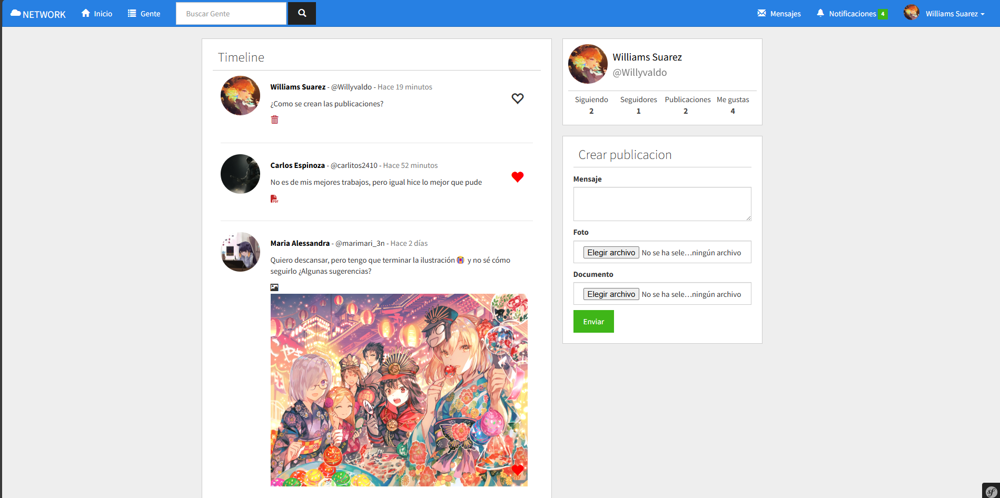

# SF Social Network
Red social en symfony 3

Vista Previa


## Herramientas
1. Symfony 3.0
2. MySQL >= 8
3. BootStrap >= 3.3.7
4. FontAwesome >= 6.4
5. JQuery >= 1.12
6. JQuery-IAS >= 2.2.2
7. AlertifyJS >= 1.13.1
8. PHP >= 8
9. Composer *
9. Symfony-Cli 5.*

## Iniciar
Una vez tenga instalado la Symfony-Cli en su linea de comandos, navegue hasta el proyecto he instale las dependencias con Composer
```sh
composer install
```

Luego entre en el archivo env. y configure sus credenciales para la base de datos, el puerto de conexion, el usuario y la contraseña. Si necesita mas informacion de como hacer esto puede presionar aqui[Conectarse a la base de datos](https://symfony.com/doc/current/doctrine.html#configuring-the-database)

Luego ejecute los siguientes comandos para crear la base de datos, crear el schema y subir las tablas al schema
```sh
symfony doctrine:database:create
symfony doctrine:schema:create
symfony doctrine:schema:update --force
```

Ya solo nos queda ejecutar el servidor local para ver el proyecto
```sh
symfony server:start
```
Y dirijase a la ruta http://127.0.0.1:8000/register en su navegador para registrarse por primera vez (Recuerde que la direccion y el puerto pueden variar)

Para terminar el servidor local presione Ctrl + C

## Sobre el Proyecto
Este proyecto fue realizado con Symfony 3 (descontinuado) hace 2 años con el proposito de practicar y aprender mas sobre el framework. Actualmente cuenta con funciones de creacion de publicaciones (funciones como crear publicaciones, eliminarlas y verlas), funciones de cuentas de usuario comunes en redes sociales (como registrarse, editar datos personales, seguir a otros usuarios y dar like a publicaciones), funciones de notificaciones a los usuarios(cuando alguien te sigue, cuando le dan like a tu publicacion) y funciones de mensajeria (actualmente solo puedes enviar mensajes, y ver los enviados, pero no se ha implementado manera de ver mensajes recibidos). A pesar de que fue por poco tiempo este proyecto me ayudó mucho a entender arquitecturas MVC, programacion orientada a objetos con PHP y fue mi primer proyecto mas o menos serio usando el framework, a pesar de que no he encontrado el tiempo para continuarlo, siempre lo recordaré con cariño.
